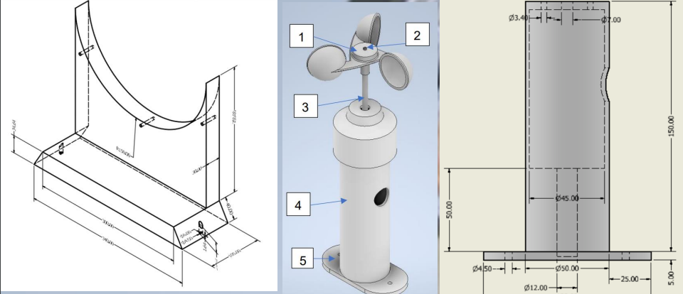

# Community-Engagement-Program
This project involves the design and development of didactic prototypes aimed at helping children understand renewable energy concepts, specifically focusing on wind energy. The project includes:

Electronic Design: Design of PCB boards for educational prototypes.

Internal Wiring: Wire modeling using Autodesk Inventor.

Mechanical Design: Proper dimensioning and machining techniques to bring the prototypes to life.

Wind Energy System: The prototype includes a fan and generator to demonstrate wind energy.

The goal of this project is to create hands-on tools for educational purposes, enabling a better understanding of renewable energy systems in an interactive way.

## Mechanical Design
After taking the dimensions of the components into reality by using Inventor we need to specify to the mechanized laboratory exactly how this is supposed to be made, the fan is expected to be build by mechanizing it from a steel block, with the following dimensions:

## PCB's design
The requirements for this didactic module were that it needs to show qualitified and visualized the amount of energy produced by the wind generator. In order to do so, we've created PCB's that contains 7 segments led arrays and little incandescent bulbs by making the corresponding PCB's as shown in:

After making the PCB's usign proteus we export this into inventor by using a proteus option, and after verifying that it does fullfil the standards we incorporate this new modules to the existing 3D CAD design

## Connection using Proteus modules and Inventor
After exporting the corresponing PCB's for each of the parts (the luminosity required to show the quantity of the wind energy and the displays showing the exact amount of energy consumed) the next step is to connect this new modules into the existing microcontrollers such as ATmega328P (Arduino Module), after succesfully connecting this components the next part is to make sure that the physical restrictions do not interfere with the connections, since the cables are numbered specifying the current that they can pass.

## Drawings (DWG) using Inventor
The mechanical design was used to verify the sustainability of the project and how realistic is to build this didactic equipment by following real life restrictions. After the process ended the final squematic looks like this:

